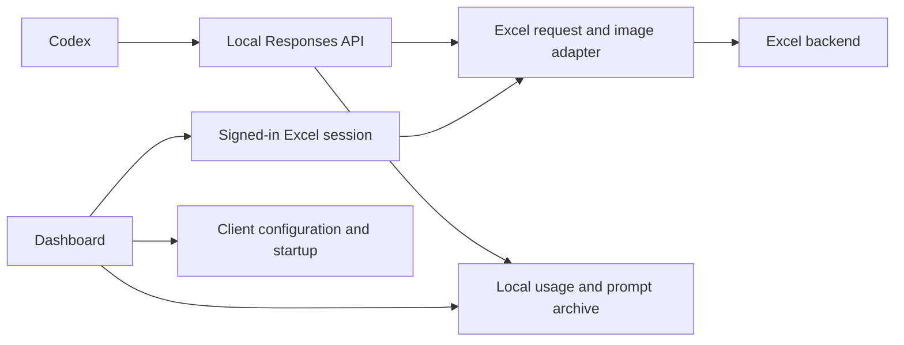

# Excel-only proxy implementation plan

**Goal:** Use the authenticated ChatGPT Excel session as the sole upstream, with no GitHub authentication, Copilot SDK, or GitHub update requests.

**Architecture:** Keep the existing Excel request adapter, image uploads, streaming lifecycle, prompt archives, and local client configuration. Remove the parallel Copilot protocol stack and present a small Excel dashboard.

**Tech stack:** Python 3.11+, FastAPI, httpx, HTML/CSS/JavaScript.

## Constraints and decisions

- Preserve the working tree's existing Excel fixes; a source snapshot was saved before edits.
- Keep existing runtime paths and `GHCP_*` environment variables so saved Excel sessions and client backups remain usable.
- Keep the four advertised Excel model IDs; accept their plain upstream names and use the Excel default when the model is omitted. Reject unknown models before session discovery or HTTP traffic.
- Keep Responses and compaction endpoints. Remove the Copilot-only Chat Completions and Anthropic routes and their client setup.
- Keep local token accounting; do not present Copilot quotas or fabricated Excel subscription costs.
- No live upstream requests during verification. Do not restart the user's running proxy or edit their active client configuration for testing.
- Run tests through `.venv/Scripts/python.exe -B tools/test-proxy-contracts.py`; no broad pytest discovery.

## ADR: a single Excel upstream

The user exclusively uses Excel. The existing `/responses` handler dispatches Excel aliases first, but other models, startup hooks, model discovery, and dashboard authentication depend on Copilot. A backend toggle would keep the unwanted code and allow accidental GitHub calls. Remove that alternative and use the local Excel capability table for both `/models` and the Codex catalog. The tradeoff is intentionally dropping Copilot and Anthropic compatibility while retaining the established Excel protocol behavior.

## Execution

- [x] Establish baseline: 115 offline regression tests passed.
- [x] Add HTTP regressions for Excel-only model discovery, aliases/defaults, unsupported models, removed routes, and startup without GitHub dependencies.
- [x] Remove Copilot dispatch, authentication, SDK scanning, update notices, multi-provider routing, and obsolete dependencies; retain Excel streaming and compaction behavior.
- [x] Restrict the client catalog to Excel and preserve configuration backup/restore behavior.
- [x] Simplify the dashboard to Excel session setup, explicit connection testing, Codex configuration, startup settings, usage and prompt drill-down.
- [x] Delete modules/tests/tools whose only purpose was the removed backend. Update the README and selected regression runner.
- [x] Run offline regressions and syntax/import checks. Verify dashboard desktop/mobile layouts and interactions using an isolated server, then stop it and close the browser tab.

## Verification outcome

- 141 selected offline regressions passed through the repository virtualenv.
- Syntax, undefined-global and local-module reference checks passed for all 35 Python files; `git diff --check` passed.
- An isolated dashboard on port 18765 used disposable config paths and mocked HTTP transports. No live Excel request, user session discovery, startup change, or active Codex configuration change was made for testing.
- Browser checks covered missing/ready sessions, cache clearing, manual connection testing, model selection, Codex enable/restore, settings toggles, usage totals, filtering, pagination, and escaped lazy-loaded prompt details. Desktop and mobile layouts had no document overflow; browser error and warning logs were empty.
- The temporary browser tab was closed and its viewport override reset. The owned QA process was stopped.
- The source snapshot was retained. Existing Excel request, image and replay fixes were preserved; obsolete test mocks were removed with their backend dependencies.
- [ ] Remove the disposable `qa-data` directory. Automatic tool approval blocked the deletion without a more specific reason; the directory was left in `C:/Users/Tom/AppData/Local/Temp/excel-only-before-4suvth51/qa-data`.
