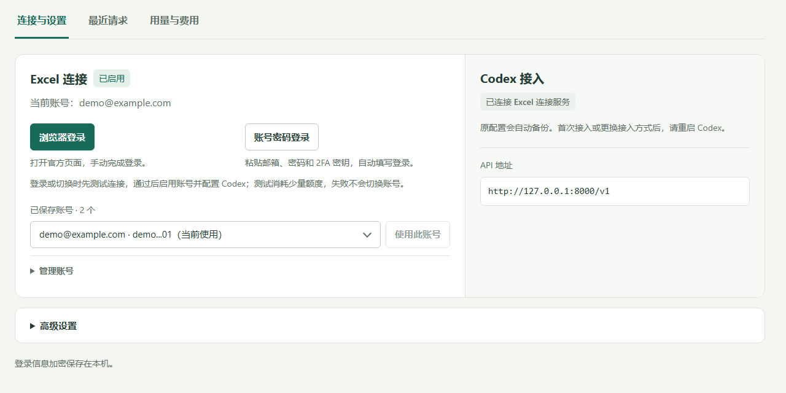

<div align="center">

<h1>Excel Connection Service</h1>

<p><strong>Use the OpenAI Excel backend from Codex.</strong></p>

<p><strong>English</strong> · <a href="readme.zh-CN.md">简体中文</a></p>

<p>
  
  
  <a href="LICENSE"></a>
</p>

<p>
  <a href="#quick-start">Quick start</a> ·
  <a href="#documentation">Documentation</a> ·
  <a href="#acknowledgments">Acknowledgments</a> ·
  <a href="#license">License</a> ·
  <a href="https://github.com/AuroraWhisperer/excel-proxy/issues">Report an issue</a>
</p>

</div>

The service translates Codex requests for the Excel/BPS backend and streams replies and tool calls back. Codex handles file access, code edits, and shell commands.

```text
Codex → Excel Connection Service on your machine → OpenAI Excel/BPS backend
```

## Features

| Feature | Details |
| --- | --- |
| Conversations | Streaming replies, tool calls, and context compaction. |
| Images | Image input, generation, and editing. |
| Accounts | Direct sign-in, manual account switching, encrypted credentials, and token refresh on Windows. |
| Dashboard | Connection settings, recent requests, quotas, and usage estimates. |
| Configuration recovery | Back up Codex settings and restore them when the service stops. |

> This is not an official OpenAI or Microsoft integration. Your account needs access to the Excel/BPS backend and selected model; account quotas apply.

## Interface preview



Shown with example accounts. The interface is currently in Chinese.

## Quick start

### Windows

**Requirements:**

- Git, Python 3.11 or later, and Codex.
- Edge or Chrome for sign-in, and the WebView2 Runtime for the desktop window.
- An OpenAI account with Excel/BPS access. Excel itself is not required for direct sign-in.

#### 1. Install

Run in PowerShell:

```powershell
git clone https://github.com/AuroraWhisperer/excel-proxy.git
cd excel-proxy
py -3 -m venv .venv
./.venv/Scripts/python.exe -m pip install -r requirements.txt
```

#### 2. Sign in

Double-click **启动.vbs** to open the app:

1. Click **登录并连接** (Sign in and connect) and finish sign-in in the official authorization window.
2. The app validates the account with a short model request, using a small amount of quota. On success, it enables the account and backs up and updates your Codex configuration.
3. Restart Codex and start a new conversation.

#### 3. Use it daily

To switch accounts, select one and click **使用此账号** (Use this account). Requests in progress keep their original account. Minimize the window to keep the service running; click **×** to stop it.

Connection tests, Excel session import, and configuration recovery are under **高级设置** (Advanced settings). See the [sign-in guide](docs/direct-login.md) for details.

### macOS

<details>
<summary><strong>Use an existing Excel add-in session</strong></summary>

Install Git and Python 3.11 or later, and sign in to the OpenAI Excel add-in first. Then run:

```bash
git clone https://github.com/AuroraWhisperer/excel-proxy.git
cd excel-proxy
bash tools/install_macos.sh
./.venv/bin/python -B app/proxy.py
```

Open the [local dashboard](http://127.0.0.1:8000/). Under **高级设置**, click **读取 Excel 登录** to load the add-in session, then **启用接入** to configure Codex. Restart Codex after the first setup.

Direct sign-in with encrypted account storage is currently Windows-only.

</details>

## Documentation

See the [documentation index](docs/README.md) for all guides (in Chinese).

| Guide | Contents |
| --- | --- |
| [User guide](docs/使用说明.md) | Setup, updates, configuration recovery, and troubleshooting |
| [Sign-in and multiple accounts](docs/direct-login.md) | Direct sign-in, account switching, encrypted storage, and token refresh |
| [Account quotas](docs/account-balances.md) | Account imports, quota displays, and reporting periods |
| [API and compatibility](docs/api.md) | Endpoints, model IDs, tool support, and image limits |
| [Privacy and local data](docs/privacy.md) | Data sent to services, credential storage, and request logs |
| [Developer notes](docs/开发说明.md) | Module responsibilities, internal protocols, tests, and runtime options |
| [References and changes](docs/参考项目与改进.md) | Implementation references and the changes they informed |

## Acknowledgments

Thanks to the authors and contributors of these projects:

| Project | What we referenced |
| --- | --- |
| [ranxi2001/sub2api](https://github.com/ranxi2001/sub2api) | Excel/Basispoints protocol handling, tool history and batch validation, tool transport recovery, and image limits. |
| [Kaixxrua/excel-codex-bridge](https://github.com/Kaixxrua/excel-codex-bridge) | Local Codex-to-Excel bridging, local access protection, client tool conversion, attachment uploads, and error handling. |

See the [reference notes](docs/参考项目与改进.md) for source versions and adaptation details.

## License

Unless otherwise noted, this project is licensed under [AGPL-3.0-only](LICENSE).

Versions and material released under the [Unlicense](https://github.com/AuroraWhisperer/excel-proxy/blob/3cf755eb9ed5c162e2f90ec2c950825112c548af/LICENSE) retain that license. Third-party code and dependencies retain their own licenses and attribution requirements.
